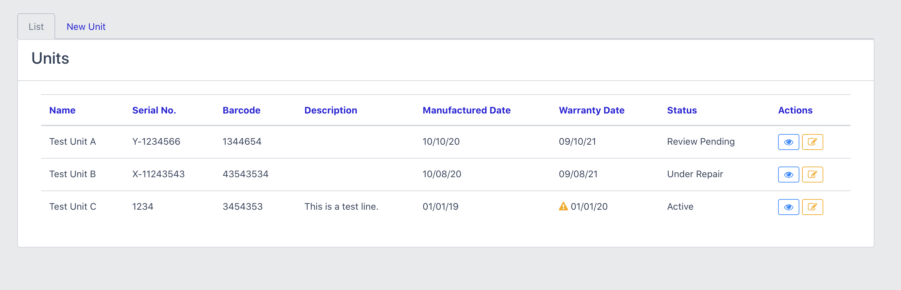
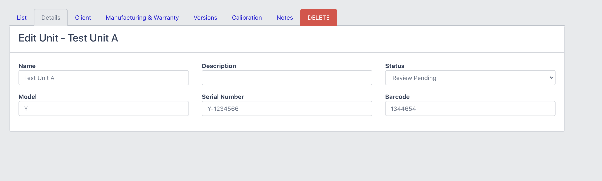

# Laravel Units Package

[](//packagist.org/packages/duncanrmorris/units)
[](//packagist.org/packages/duncanrmorris/units)
[](//packagist.org/packages/duncanrmorris/units)
[](//packagist.org/packages/duncanrmorris/units)




Welcome to the Units package for Laravel ^7.2, which provides a complete solution to unit management.

The Unit package is designed to be used with other packages from DRMorris IT Services, to check out these packages head over to https://github.com/DRMorris-IT-Services

## Installation

To use our package, follow these simple installation instructions.

### Step 1

Setup your Laravel project as required, then run the command:

````
composer require duncanrmorris/units
````

### Step 2

Once the composer has completed the installation, you will need to add the Service Provider in your "./config/app.php" file:

````
'providers' => [

        /*
         * Laravel Framework Service Providers...
         */
        Illuminate\Auth\AuthServiceProvider::class,
        Illuminate\Broadcasting\BroadcastServiceProvider::class,
        Illuminate\Bus\BusServiceProvider::class,
        ///
        duncanrmorris\units\UnitsServiceProvider::class,
````

### Step 3

You will then need to run the database tables setup via:

````
php artisan migrate
````

### Step 4

You will now be able to route to this new module via "/units", for example:

````
<a href="/units">Units</a>
````

        
